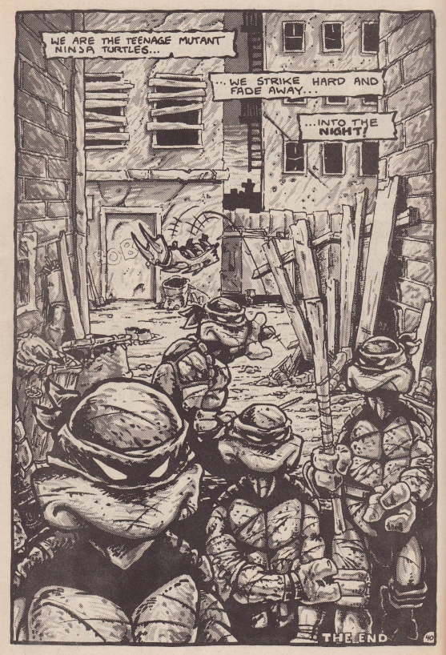
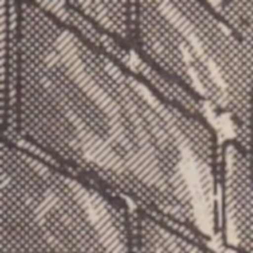

# DuoShader

An attempt to create a Duotone / Duoshade effect similar to the old black and white comic book printing technique made famous by Teenage Mutant Ninja Turtles, 1984.

At first glance it looks like this is printing with 4 shades: black, dark, light, white. But a closer zoom reveals that the shades are made by fine diagonal stripes in black ink.

This effect was achieved by the artist before printing by using a special type of paper with pre-printed diagonal lines. The lines appear in a very light blue ink which does not get picked up in the printing process. There are also two chemical paints, one which darkens one set of the diagonal lines, and another which darkens both.

Here is [a video of the process in action](https://youtu.be/GftgBL-sHnI?t=110).

## How to use this shader

This is a full-screen effect shader, so it needs to be applied to your camera render with a script.

## Material Properties

- `Developed Colour` the colour of the lines when developed by the chemicals
- `Undeveloped Colour` the colour of the lines before being developed
- `Ink Colour` colour of the ink at the output stage
- `Paper Colour` colour of the paper at the output stage
- `Undeveloped Level` the luma level of the source image which remains undeveloped
- `Frequency` represents the approximate width of the diagonal lines in screen pixels
- `Thickness` adjust the thickness of the duoshade lines in the range from 0 to 1 as a fraction of the `Frequency`
- `Fringe` the thickness of the blended edge of the duoshade line as above for smoothing
- `Black` the luma level considered black at the input stage
- `Dark` the luma level required to expose both lines
- `Light` the luma level required to expose one set of diagonal lines
- `PrintBlackLevel` the luma level at the output stage considered black
- `Noise` the level of noise introduced into the process (helps to reduce banding between light levels)

## Example Scene

This component contains the shader, a material, and a script to apply it to the camera. To add this effect to your scene, assign the ScreenEffect script to your camera and choose the DuoShader material as the `screenEffect`.

I have added the Toon shader components from the Unity Essentials pack to provide the outline and quantised colour.

## Customisation

If you already have your own script that applies a `Graphics.Blit` to the camera, you can substitute it for the script supplied here. And if you already have a `Material` assigned for use you can substitute that as well by simply selecting `ScreenEffect/DuoShader` as the shader for your material.
